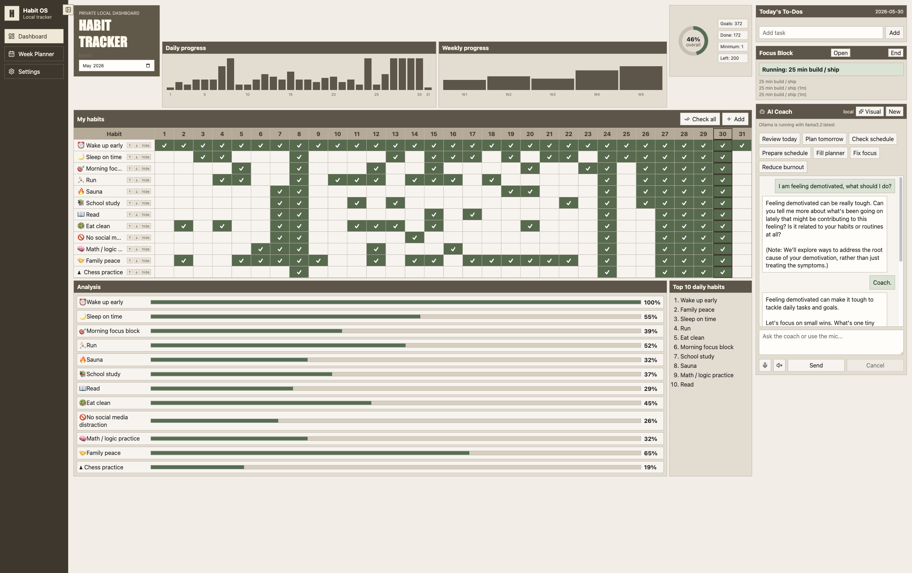
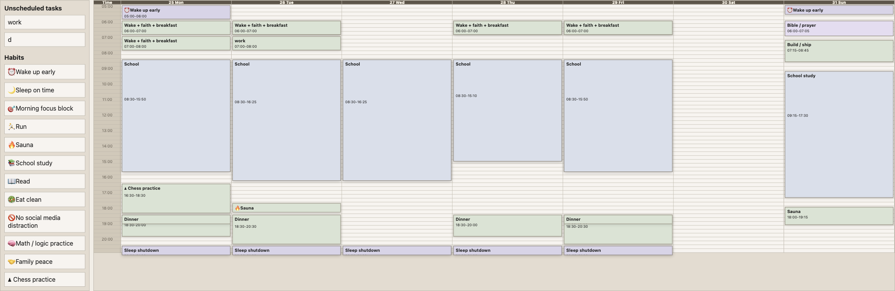
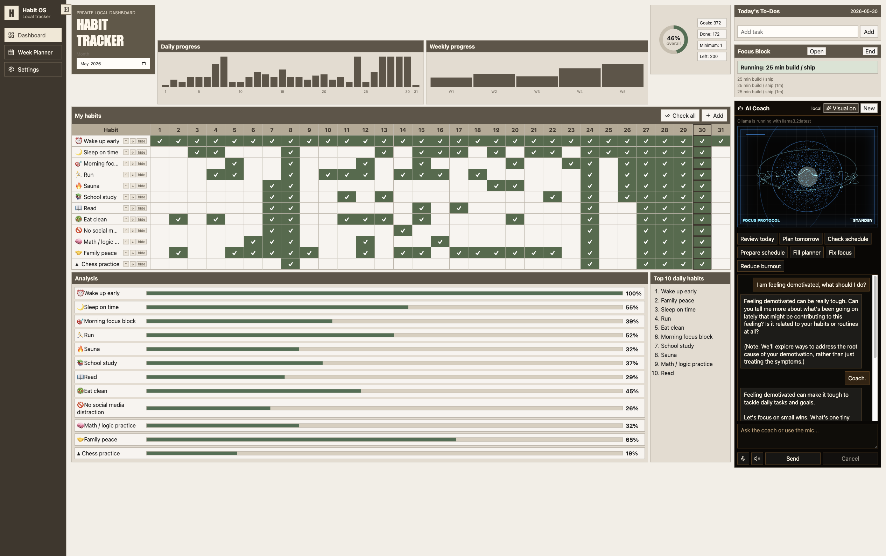
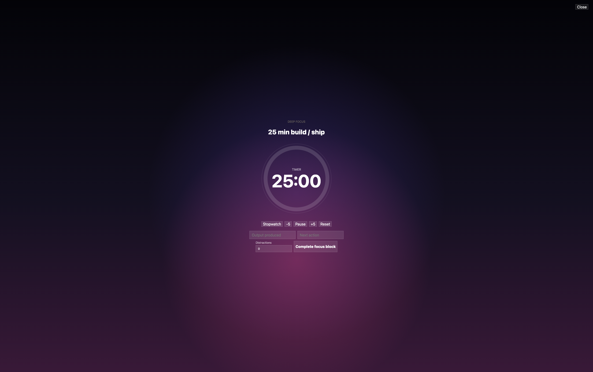

# Habit AI Tracker

Local-first Electron desktop app for a spreadsheet-style habit dashboard, weekly planner, and Ollama-powered AI coach.

New installs start with an empty profile, no starter projects, and no starter habits. Your data stays local on your machine.

## Screenshots



| Weekly planner                                       | AI coach visual mode                                          |
| ---------------------------------------------------- | ------------------------------------------------------------- |
|  |  |



## Stack

- Electron + React + TypeScript + Vite
- SQLite through Node's built-in `node:sqlite`
- Zod-validated IPC through `preload` + `contextBridge`
- TanStack Query for renderer async state
- Zustand for UI-only state
- dnd-kit for weekly planner drag/drop
- Ollama local AI chat
- Vitest for deterministic unit tests

## Install

### Download The App

Go to [Releases](https://github.com/PopetoNM/Habit-AI-Tracker/releases) and download the installer for your OS:

- macOS: `.dmg`
- Windows: `.exe`
- Linux: `.AppImage` or `.deb`

The app is currently unsigned. On macOS, right-click the app and choose **Open** the first time. On Windows, SmartScreen may require **More info** -> **Run anyway**.

### Requirements

- macOS, Linux, or Windows
- Node.js 24 or newer
- npm
- Optional: Ollama for the local AI coach

### Run Locally

```bash
git clone https://github.com/PopetoNM/Habit-AI-Tracker.git
cd Habit-AI-Tracker
npm install
npm run dev
```

The app opens as an Electron desktop window. If Electron does not open cleanly from a shell that previously ran Node tooling, use:

```bash
unset ELECTRON_RUN_AS_NODE
npm run dev
```

### Set Up Local AI

Install Ollama from <https://ollama.com>, then pull a starter model:

```bash
ollama pull llama3.2:3b
```

Start Ollama before using the coach:

```bash
ollama serve
```

You can change the model in Settings. The app still works without Ollama; only the AI coach is offline.

Voice transcription uses a local Whisper model through Transformers.js. The first transcription may download `Xenova/whisper-tiny.en`.

### Useful Commands

```bash
npm run typecheck
npm test
npm run test:e2e
npm run build
npm run preview
```

### Package For macOS

```bash
npm run package:mac
```

The packaged app is written to `dist/`.

### Create A Release

Maintainers can create downloadable installers by pushing a version tag:

```bash
git tag v0.1.0
git push origin v0.1.0
```

GitHub Actions builds macOS, Windows, and Linux installers and attaches them to the release.

## First-Run Setup

1. Open Settings.
2. Add your habits under "Habits and customization".
3. Add your profile notes so the coach can use your priorities and constraints.
4. Choose an installed Ollama model if you want local AI chat.
5. Start using the dashboard, planner, and focus timer.

No personal habits, profile, or planner templates are shipped with the repository.

## Data And Privacy

Runtime data is stored in Electron `userData` on your machine. Local script data is stored under `data/`, which is ignored by git.

Typical locations:

- macOS: `~/Library/Application Support/habit-ai-tracker/`
- Windows: `%APPDATA%/habit-ai-tracker/`
- Linux: `~/.config/habit-ai-tracker/`

Your habits, check-ins, planner blocks, coach history, focus sessions, and backups live there. Back up that folder if you rely on the app every day.

Do not commit local databases, exports, backups, `.env` files, or internal workflow artifacts. The repo ignores:

```bash
data/
.codex/
specs/
Habit_tracker_plan.md
*.sqlite
*.xlsx
```

## Development

```bash
npm install
npm run typecheck
npm test -- --run
npm run test:e2e
```

## Daily Use Notes

- The tracker works fully offline except for optional Ollama model calls.
- The AI coach needs Ollama running locally.
- Voice transcription runs locally and may download the Whisper model on first use.
- Data persists automatically in the Electron user data folder.
- Use Settings to add your own habits and profile before relying on the coach.

## License

MIT
